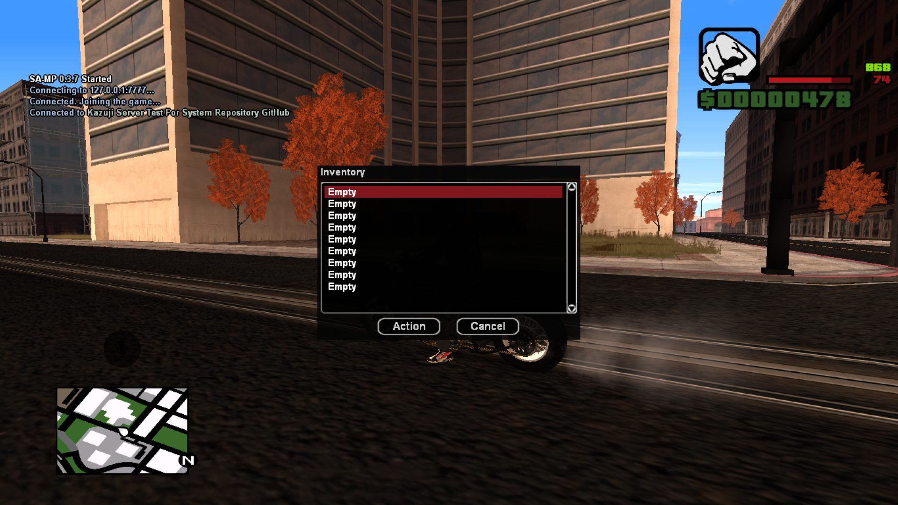
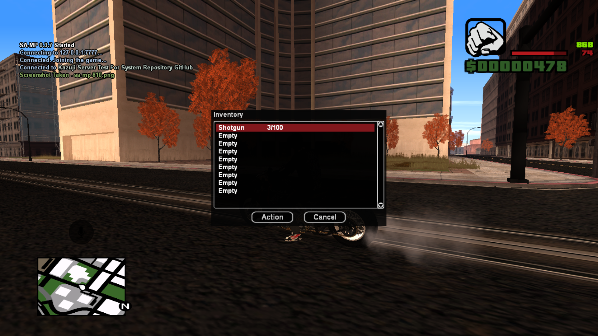
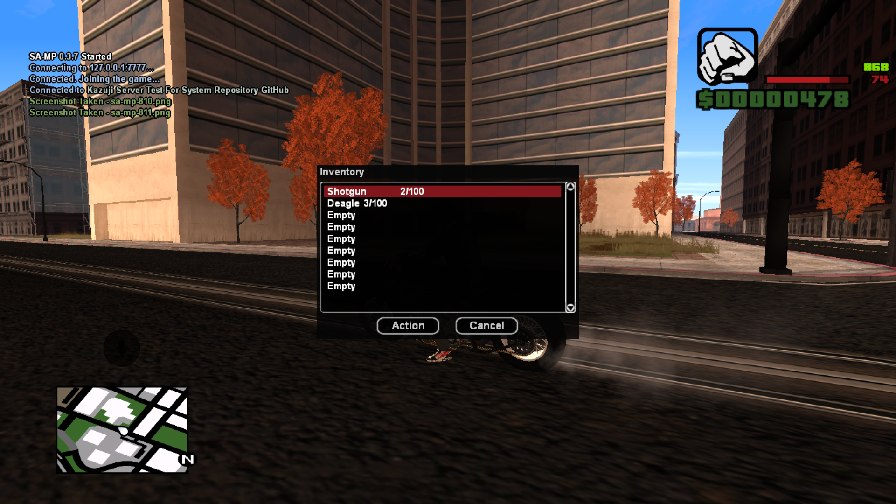
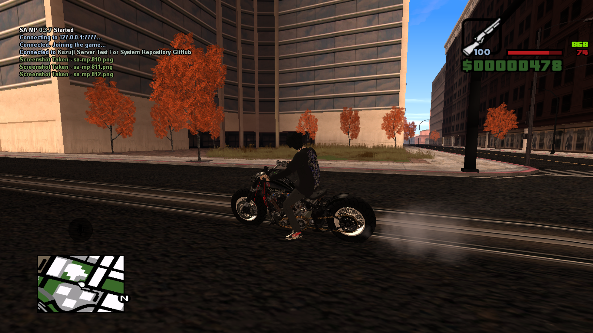

# Kazuji-Inventory

# PREVIEW
<a href=https://github.com/KzjTkshi/Kazuji-Dialog-Inventory></img></a>
<a href=https://github.com/KzjTkshi/Kazuji-Dialog-Inventory></img></a>
<a href=https://github.com/KzjTkshi/Kazuji-Dialog-Inventory></img></a>
<a href=https://github.com/KzjTkshi/Kazuji-Dialog-Inventory></img></a>

# [ENG]
`Inventory systems like State Of Decay SAMP [Inspiration], I made this just for fun`
# [ID] 
`Sistem inventaris seperti State Of Decay SAMP [Inspirasi], saya buat ini hanya untuk bersenang-senang`
# [NIHON]
`SAMP の State Of Decay [インスピレーション] のような、ただ楽しむために作られたインベントリ システム`

